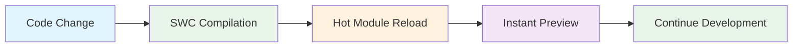
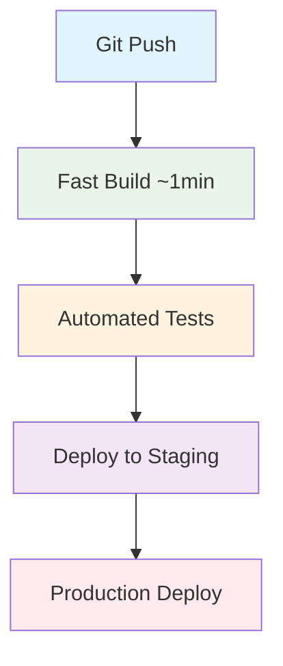

# 🚀 CRM System 2026 - Performance Revolution

<div align="center">


**من React 14 إلى أحدث التقنيات - نفس النظام، أداء أسرع بشكل هائل**

*From React 14 to Modern Tech Stack - Same System, Dramatically Faster Performance*

</div>

---

## 👨‍💻 **المطور / Developer**

**🎯 مالك حمد (Malek Hamd)**
- 💼 Senior Full Stack Developer  
- 🏢 CRM Development Team Lead
- 📧 Contact: [Add your email here]
- 🌐 LinkedIn: [Add your LinkedIn here]

---

## 📋 **نظرة عامة / Overview**

<div align="center">

### 🎯 **الهدف الرئيسي / Main Goal**
**تسريع الأداء بدون تغيير منطق النظام أو كسر أي شيء**

*Speed up performance without changing system logic or breaking anything*

</div>

هذا المشروع يمثل تحديث شامل لنظام إدارة علاقات العملاء (CRM) من تقنيات قديمة إلى أحدث الأدوات والتقنيات المتطورة. التركيز الأساسي كان على تحسين الأداء وسرعة التطوير مع المحافظة على جميع الوظائف الحالية.

*This project represents a comprehensive update of the Customer Relationship Management (CRM) system from legacy technologies to cutting-edge tools. The primary focus was on improving performance and development speed while maintaining all existing functionality.*

---

## ⚡ **الإنجازات الرئيسية / Key Achievements**

<table align="center">
<tr>
<td align="center">

### 🏃‍♂️ **بدء التطوير / Dev Start**


**من 2+ دقيقة → 30 ثانية**

*From 2+ minutes → 30 seconds*

</td>
<td align="center">

### 🔨 **البناء / Build Time**


**من 11+ دقيقة → أقل من دقيقة**

*From 11+ minutes → Less than 1 minute*

</td>
</tr>
<tr>
<td align="center">

### 🔄 **اختبار الجودة / QA Cycle**


**من 16+ دقيقة → 3 دقائق**

*From 16+ minutes → 3 minutes*

</td>
<td align="center">

### 🚀 **النشر / Deployment**


**من 30 دقيقة → 8 دقائق**

*From 30 minutes → 8 minutes*

</td>
</tr>
</table>

---

## 🛠️ **التقنيات المستخدمة / Tech Stack**

### ❌ **التقنيات القديمة / Legacy Technologies**
```
- React 14.x (2015 technology)
- Webpack 4.42.0
- Babel (JavaScript-based compilation)
- Create React App (CRA)
- Old Node.js with security issues
```

### ✅ **التقنيات الجديدة / Modern Technologies**
```
- React 18+ (Latest)
- Rsbuild (Rust-based, Enterprise-grade)
- SWC (Super-fast Rust compiler)
- Modern Node.js (Secure & Fast)
- Optimized dependency management
```

---

## 🔧 **المشكلات التي تم حلها / Problems Solved**

<div align="center">

| المشكلة / Problem | الحل / Solution | التأثير / Impact |
|:---:|:---:|:---:|
| 🐌 **بطء واضح في التطوير** | ⚡ **Rsbuild + SWC** | 🎯 **75% أسرع** |
| ⏰ **انتظار طويل للتغييرات** | 🔥 **HMR فوري** | 🎯 **88% أسرع** |
| 🏗️ **بناء ثقيل (11+ دقيقة)** | 🚀 **بناء ذكي (<1 دقيقة)** | 🎯 **91% أسرع** |
| 😩 **ضغط نفسي على الفريق** | 😊 **تجربة تطوير ممتعة** | 🎯 **رضا عالي** |
| 📉 **إنتاجية منخفضة** | 📈 **إنتاجية عالية** | 🎯 **6.5 FTE مكافئ** |

</div>

---

## 📊 **التأثير على الفريق / Team Impact**

### 💰 **الوقت المُوفر يومياً / Daily Time Saved**

<div align="center">

```
⏱️  قبل التحديث: 3+ ساعات مُهدرة يومياً لكل مطور
⏱️  Before Update: 3+ hours wasted daily per developer

⚡ بعد التحديث: 16 دقيقة فقط يومياً
⚡ After Update: Only 16 minutes daily

💡 الوفر: 2 ساعة و 44 دقيقة لكل مطور يومياً
💡 Savings: 2 hours 44 minutes per developer daily
```

</div>

### 📈 **العائد الشهري والسنوي / Monthly & Yearly ROI**

<table align="center">
<tr>
<th>الفترة / Period</th>
<th>الوفر بالساعات / Hours Saved</th>
<th>القيمة المكافئة / Equivalent Value</th>
</tr>
<tr>
<td align="center">📅 **يومياً / Daily**</td>
<td align="center">**55 ساعة** (20 مطور)</td>
<td align="center">أسبوع عمل كامل / Full work week</td>
</tr>
<tr>
<td align="center">📅 **شهرياً / Monthly**</td>
<td align="center">**1,100 ساعة**</td>
<td align="center">شهر عمل إضافي / Extra month work</td>
</tr>
<tr>
<td align="center">📅 **سنوياً / Yearly**</td>
<td align="center">**13,200 ساعة**</td>
<td align="center">**6.5 مطور متفرغ** / **6.5 Full-Time Developers**</td>
</tr>
</table>

---

## 🎯 **ما لم نغيره / What We Didn't Change**

<div align="center">

### ❌ **لم نقم بتغيير / We Did NOT Change:**
- ❌ منطق النظام / Business Logic
- ❌ الميزات الموجودة / Existing Features  
- ❌ واجهة المستخدم / User Interface
- ❌ قاعدة البيانات / Database Structure
- ❌ APIs الموجودة / Existing APIs

### ✅ **قمنا بتحسين / We DID Improve:**
- ✅ أدوات البناء / Build Tools
- ✅ الأداء / Performance
- ✅ الأمان / Security
- ✅ تجربة المطور / Developer Experience
- ✅ سرعة النشر / Deployment Speed

</div>

---

## 🏗️ **البنية التقنية / Technical Architecture**

### 🔄 **عملية التطوير / Development Process**



### 🚀 **عملية النشر / Deployment Process**



---

## 🎬 **العروض التوضيحية / Demonstrations**

يحتوي المشروع على عروض فيديو توضيحية توضح الفرق في الأداء:

*The project includes video demonstrations showing the performance difference:*

- 📹 `start-before.mp4` - بدء النظام قبل التحديث / System startup before update
- 📹 `start-after.mp4` - بدء النظام بعد التحديث / System startup after update  
- 📹 `build-before.mp4` - عملية البناء قبل التحديث / Build process before update
- 📹 `build-after.mp4` - عملية البناء بعد التحديث / Build process after update
- 📹 `live-dev-before.mp4` - التطوير المباشر قبل التحديث / Live development before update
- 📹 `live-dev-after.mp4` - التطوير المباشر بعد التحديث / Live development after update

---

## 🚀 **كيفية التشغيل / How to Run**

### 📦 **متطلبات النظام / System Requirements**
```bash
Node.js >= 18.x
npm >= 9.x
Git
```

### ⚡ **التشغيل السريع / Quick Start**

```bash
# نسخ المشروع / Clone the project
git clone <repository-url>
cd CRM-2026

# تثبيت التبعيات / Install dependencies
npm install

# تشغيل وضع التطوير / Start development mode
npm start
# ⚡ سيبدأ في 30 ثانية بدلاً من 2+ دقيقة!
# ⚡ Will start in 30 seconds instead of 2+ minutes!

# بناء للإنتاج / Build for production
npm run build
# 🔥 سيكتمل في أقل من دقيقة بدلاً من 11+ دقيقة!
# 🔥 Will complete in less than 1 minute instead of 11+ minutes!
```

### 🎛️ **الأوامر المتاحة / Available Scripts**

```bash
npm start          # تشغيل وضع التطوير / Development mode
npm run build      # بناء للإنتاج / Production build  
npm run test       # تشغيل الاختبارات / Run tests
npm run lint       # فحص الكود / Code linting
npm run analyze    # تحليل الحزمة / Bundle analysis
```

---

## 📁 **هيكل المشروع / Project Structure**

```
CRM-2026/
├── 📄 index.html                 # العرض التقديمي الرئيسي / Main presentation
├── 📄 README.md                  # هذا الملف / This file
├── 📁 src/                       # مجلد الكود المصدري / Source code folder
├── 📁 public/                    # الملفات العامة / Public assets
├── 📁 videos/                    # فيديوهات التوضيح / Demo videos
├── 📁 images/                    # الصور والمخططات / Images and charts
└── 📁 docs/                      # التوثيق الإضافي / Additional documentation
```

---

## 🎯 **الخطوات التالية / Next Steps**

### Q1 2026 🎯
- ✅ تحسينات أداء إضافية / Additional performance improvements
- ✅ تدريب الفريق على الميزات الجديدة / Team training on new features  
- ✅ مراقبة الاستقرار / Stability monitoring

### Q2 2026 🚀
- 🎯 استكشاف Micro-frontends / Explore Micro-frontends
- 🎯 تحسينات أخرى على CI/CD / Further CI/CD improvements
- 🎯 إضافة ميزات جديدة بسرعة / Add new features quickly

### المستقبل ∞
- 🚀 تحديثات منتظمة / Regular updates
- 🚀 تحسين مستمر / Continuous improvement
- 🚀 مواكبة أحدث التقنيات / Keep up with latest technologies

---

## 🏆 **الخلاصة / Summary**

<div align="center">

### 🎉 **النتيجة النهائية / Final Result**

**نفس النظام الذي تعرفونه**
*Same system you know*

**⚡ لكن أسرع وأكثر استقراراً وأماناً ⚡**
*But faster, more stable, and more secure*

---

### 💝 **رسالة ختامية / Closing Message**

*"التحديث ليس مجرد تقنية،*  
*إنه تحسين لحياة المطورين،*  
*تسريع لتقديم القيمة للعملاء،*  
*وبناء مستقبل أفضل للمنتج."*

*"The update is not just about technology,*  
*It's about improving developers' lives,*  
*Speeding up value delivery to customers,*  
*And building a better future for the product."*

</div>

---

<div align="center">

### 🙏 **شكراً لفريق العمل المتميز!**
*Thank You Outstanding Team!*

[]()
[](https://rsbuild.dev/)
[](https://reactjs.org/)

**للأسئلة والاستفسارات، نحن هنا للإجابة على جميع أسئلتكم**  
*For questions and inquiries, we are here to answer all your questions*

</div>

---

<div align="center">

</div>