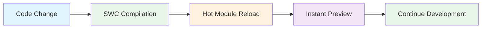
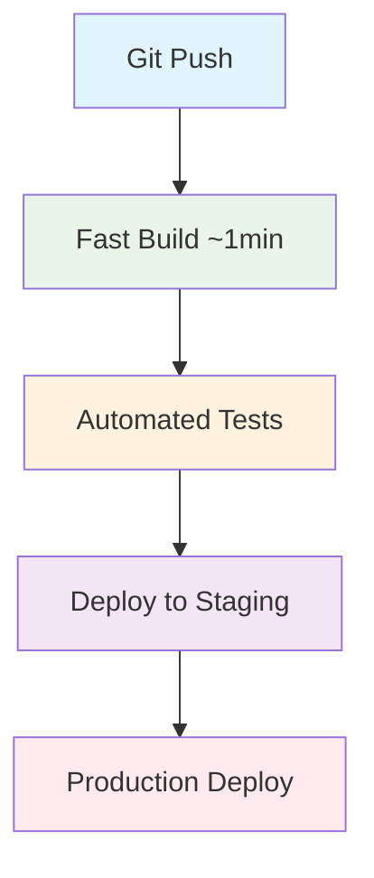

# 🚀 CRM System 2026 - Performance Revolution

<div align="center">


**From React 14 to Modern Tech Stack - Same System, Dramatically Faster Performance**

</div>

---

## 👨‍💻 **Developer**

**🎯 Malek Hamd**
- 💼 Senior Full Stack Developer  
- 🏢 CRM Development Team Lead
- 📧 Contact: [Add your email here]
- 🌐 LinkedIn: [Add your LinkedIn here]

---

## 📋 **Overview**

<div align="center">

### 🎯 **Main Goal**
**Speed up performance without changing system logic or breaking anything**

</div>

This project represents a comprehensive update of the Customer Relationship Management (CRM) system from legacy technologies to cutting-edge tools. The primary focus was on improving performance and development speed while maintaining all existing functionality.

---

## ⚡ **Key Achievements**

<table align="center">
<tr>
<td align="center">

### 🏃‍♂️ **Dev Start**


**From 2+ minutes → 30 seconds**

</td>
<td align="center">

### 🔨 **Build Time**


**From 11+ minutes → Less than 1 minute**

</td>
</tr>
<tr>
<td align="center">

### 🔄 **QA Cycle**


**From 16+ minutes → 3 minutes**

</td>
<td align="center">

### 🚀 **Deployment**


**From 30 minutes → 8 minutes**

</td>
</tr>
</table>

---

## 🛠️ **Tech Stack**

### ❌ **Legacy Technologies**
```
- React 14.x (2015 technology)
- Webpack 4.42.0
- Babel (JavaScript-based compilation)
- Create React App (CRA)
- Old Node.js with security issues
```

### ✅ **Modern Technologies**
```
- React 18+ (Latest)
- Rsbuild (Rust-based, Enterprise-grade)
- SWC (Super-fast Rust compiler)
- Modern Node.js (Secure & Fast)
- Optimized dependency management
```

---

## 🔧 **Problems Solved**

<div align="center">

| Problem | Solution | Impact |
|:---:|:---:|:---:|
| 🐌 **Obvious Development Slowness** | ⚡ **Rsbuild + SWC** | 🎯 **75% Faster** |
| ⏰ **Long Wait for Changes** | 🔥 **Instant HMR** | 🎯 **88% Faster** |
| 🏗️ **Heavy Build (11+ minutes)** | 🚀 **Smart Build (<1 minute)** | 🎯 **91% Faster** |
| 😩 **Team Mental Stress** | 😊 **Enjoyable Development Experience** | 🎯 **High Satisfaction** |
| 📉 **Low Productivity** | 📈 **High Productivity** | 🎯 **6.5 FTE Equivalent** |

</div>

---

## 📈 **Team Impact**

### 💰 **Daily Time Saved**

<div align="center">

```
⏱️  Before Update: 3+ hours wasted daily per developer
⚡ After Update: Only 16 minutes daily
💡 Savings: 2 hours 44 minutes per developer daily
```

</div>

### 📈 **Monthly & Yearly ROI**

<table align="center">
<tr>
<th>Period</th>
<th>Hours Saved</th>
<th>Equivalent Value</th>
</tr>
<tr>
<td align="center">📅 **Daily**</td>
<td align="center">**55 hours** (20 developers)</td>
<td align="center">Full work week</td>
</tr>
<tr>
<td align="center">📅 **Monthly**</td>
<td align="center">**1,100 hours**</td>
<td align="center">Extra month work</td>
</tr>
<tr>
<td align="center">📅 **Yearly**</td>
<td align="center">**13,200 hours**</td>
<td align="center">**6.5 Full-Time Developers**</td>
</tr>
</table>

---

## 🎯 **What We Didn't Change**

<div align="center">

### ❌ **We Did NOT Change:**
- ❌ Business Logic
- ❌ Existing Features  
- ❌ User Interface
- ❌ Database Structure
- ❌ Existing APIs

### ✅ **We DID Improve:**
- ✅ Build Tools
- ✅ Performance
- ✅ Security
- ✅ Developer Experience
- ✅ Deployment Speed

</div>

---

## 🏗️ **Technical Architecture**

### 🔄 **Development Process**



### 🚀 **Deployment Process**



---

## 🎦 **Demonstrations**

The project includes video demonstrations showing the performance difference:

- 📹 `start-before.mp4` - System startup before update
- 📹 `start-after.mp4` - System startup after update  
- 📹 `build-before.mp4` - Build process before update
- 📹 `build-after.mp4` - Build process after update
- 📹 `live-dev-before.mp4` - Live development before update
- 📹 `live-dev-after.mp4` - Live development after update

---

## 🚀 **How to Run**

### 📦 **System Requirements**
```bash
Node.js >= 18.x
npm >= 9.x
Git
```

### ⚡ **Quick Start**

```bash
# Clone the project
git clone <repository-url>
cd CRM-2026

# Install dependencies
npm install

# Start development mode
npm start
# ⚡ Will start in 30 seconds instead of 2+ minutes!

# Build for production
npm run build
# 🔥 Will complete in less than 1 minute instead of 11+ minutes!
```

### 🎛️ **Available Scripts**

```bash
npm start          # Development mode
npm run build      # Production build  
npm run test       # Run tests
npm run lint       # Code linting
npm run analyze    # Bundle analysis
```

---

## 📁 **Project Structure**

```
CRM-2026/
├── 📄 index.html                 # Main presentation file
├── 📄 README.md                  # This documentation file
├── 📁 src/                       # Source code directory
├── 📁 public/                    # Public assets and static files
├── 📁 videos/                    # Demo videos showcasing improvements
├── 📁 images/                    # Images and charts for documentation
└── 📁 docs/                      # Additional project documentation
```

---

## 🎯 **Next Steps**

### Q1 2026 🎯
- ✅ Additional performance improvements
- ✅ Team training on new features  
- ✅ Stability monitoring

### Q2 2026 🚀
- 🎯 Explore Micro-frontends
- 🎯 Further CI/CD improvements
- 🎯 Add new features quickly

### Future ∞
- 🚀 Regular updates
- 🚀 Continuous improvement
- 🚀 Keep up with latest technologies

---

## 🏆 **Summary**

<div align="center">

### 🎉 **Final Result**

**Same system you know**

**⚡ But faster, more stable, and more secure ⚡**

---

### 💝 **Closing Message**

*"The update is not just about technology,*  
*It's about improving developers' lives,*  
*Speeding up value delivery to customers,*  
*And building a better future for the product."*

</div>

---

<div align="center">

### 🙏 **Thank You Outstanding Team!**

[]()
[](https://rsbuild.dev/)
[](https://reactjs.org/)

**For questions and inquiries, we are here to answer all your questions**

</div>

---

<div align="center">

</div>